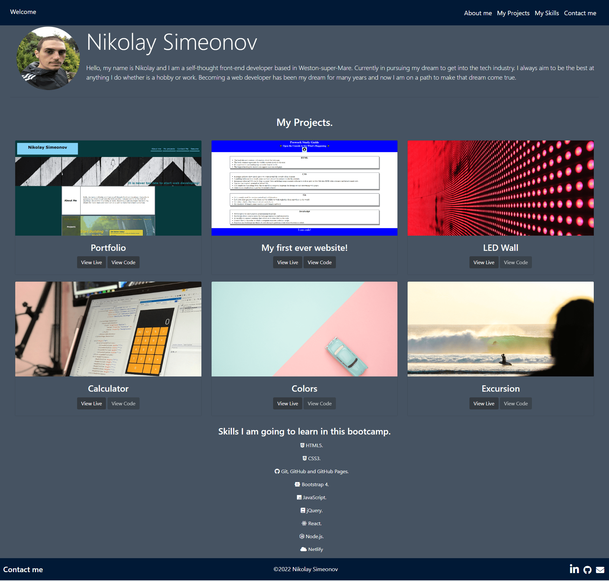

# portfolioWithBootstrap

## Description

Hello, and welcome to my portfolio webpage. You can have a quick look on the photo bellow but if you are more interested you can follow the link to my repo to view the code: https://github.com/NikSimeonov/Bootstrap-Portfolio.git

  

## Project is created with:

HTML5, CSS3, Bootstrap4

## Installation

N/A

## Usage

Personal use

## Credits

N/A

## License

N/A